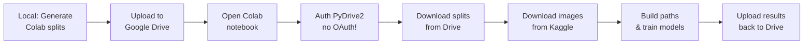

# Google Colab Setup Instructions

## Overview

This guide shows you how to run the transfer learning notebook in Google Colab with free GPU access.

## Prerequisites

- Google account with Google Drive access
- Local copy of this project
- ~7 MB of Google Drive storage for data splits

## Step-by-Step Setup

### 1. Generate Colab-Specific Data Splits

Run this locally (only needed once):

```bash
python3 scripts/prepare_colab_splits.py
```

This creates optimized CSV files in `colab/data_splits/`:
- `train_split.csv` (4.7 MB) - 80% smaller than Kaggle version
- `val_split.csv` (970 KB)
- `test_split.csv` (1000 KB)
- `preprocessing_config.json` (400 bytes)

**Total size: ~6.6 MB** (vs ~32 MB for Kaggle versions)

### 2. Upload to Google Drive

1. Go to [Google Drive](https://drive.google.com)
2. Create a new folder (e.g., "nih-colab-splits")
3. Upload all 4 files from `colab/data_splits/`
4. Open the folder and copy the folder ID from the URL:
   ```
   https://drive.google.com/drive/folders/1a2b3c4d5e6f7g8h9
                                           ^^^^^^^^^^^^^^^^
                                           This is your folder ID
   ```

### 3. Open Notebook in Colab

1. Go to [Google Colab](https://colab.research.google.com/)
2. Upload `colab/07_transfer_learning_colab.ipynb`
3. Select **Runtime → Change runtime type → T4 GPU**

### 4. Run the Notebook

Execute cells in order:

1. **Cell 1**: Check GPU
   ✓ Should show T4/A100/V100 GPU

2. **Cell 2**: Upload OAuth Credentials
   📁 Upload `client_secrets.json` when prompted
   - Get this from your local project: `.colab/client_secrets.json`
   - Or use the example: `colab/client_secrets.json.example`
   ✓ Authenticates with **your** Google Cloud project (no "third party" warnings!)

3. **Cell 3-6**: Download Data Splits from Drive
   - Cell 6 will prompt for `DATA_FOLDER_ID`
   - Update: `DATA_FOLDER_ID = 'your_folder_id_here'`
   - Then run cell to download 4 CSV files (~7 MB)
   ✓ Downloads train/val/test splits + config

4. **Cell 12-13**: Download NIH Images from Kaggle
   ⏱️ ~10-30 minutes (downloads ~47 GB of X-ray images)
   💡 kagglehub handles download automatically

5. **Cell 14-15**: Load Splits and Build Image Paths
   ✓ Constructs full paths from Image Index column
   ✓ Verifies all 112K images found

6. **Cells 16+**: Train Models
   ⏱️ ~15 min per model (sample mode) or 2-3 hours (full training)
   🎯 Trains ResNet50, DenseNet121, EfficientNetB3

## Key Differences: Kaggle vs Colab

| Feature | Kaggle Kernels | Google Colab |
|---------|----------------|--------------|
| **Data Access** | Pre-mounted dataset | Download with kagglehub |
| **CSV Files** | Full paths (`kaggle/datasets/data-splits/`) | Filenames only (`colab/data_splits/`) |
| **CSV Size** | 32 MB total | 6.6 MB total (80% smaller) |
| **GPU** | P100 (16GB), T4 (16GB) | T4 (15GB), A100 (40GB), V100 (16GB) |
| **Time Limit** | 9 hours | 12-24 hours |
| **Storage** | Drive optional | PyDrive2 for persistence |

## Workflow



## Troubleshooting

### "Missing required files" Error

Make sure you uploaded all 4 files from `colab/data_splits/`:
```
✓ train_split.csv
✓ val_split.csv
✓ test_split.csv
✓ preprocessing_config.json
```

### "Images not found" Error

This means the kagglehub download didn't complete. Check:
```python
# Verify download completed
!ls -lh /root/.cache/kagglehub/datasets/nih-chest-xrays/data/
```

Should show `images_001/` through `images_012/` subdirectories.

### Slow PyDrive2 Download

The 4 CSV files are small (6.6 MB total), so download should be <30 seconds. If slow:
- Check your internet connection
- Try uploading files again to Drive
- Verify folder ID is correct

### Out of Memory During Training

Reduce batch size in Cell 11:
```python
'batch_size': 32,  # Reduce from 64
```

Or use sample mode:
```python
'use_sample': True,
'sample_size': 500,  # Reduce from 1000
```

## Benefits of This Approach

✅ **No OAuth prompts** - PyDrive2 uses Colab's built-in auth
✅ **Small uploads** - Only 6.6 MB to Drive (vs 32 MB)
✅ **Platform agnostic** - CSVs work anywhere
✅ **Fast setup** - < 1 minute to download splits
✅ **Results persistence** - Upload trained models back to Drive
✅ **Free GPU** - T4/A100 GPUs at no cost

## Next Steps

After training completes:
1. Models saved to `/content/models/*.keras`
2. Automatically uploaded back to your Drive folder
3. Download models locally or use in deployment

## Questions?

See also:
- `colab/COLAB_PYDRIVE2_SETUP.md` - Detailed PyDrive2 guide
- `docs/PLATFORM_ORGANIZATION.md` - Project structure
- `docs/COLAB_GUIDE.md` - Advanced Colab tips
